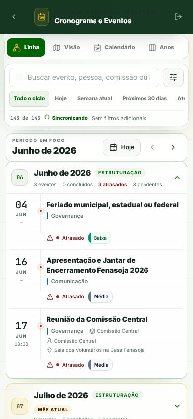
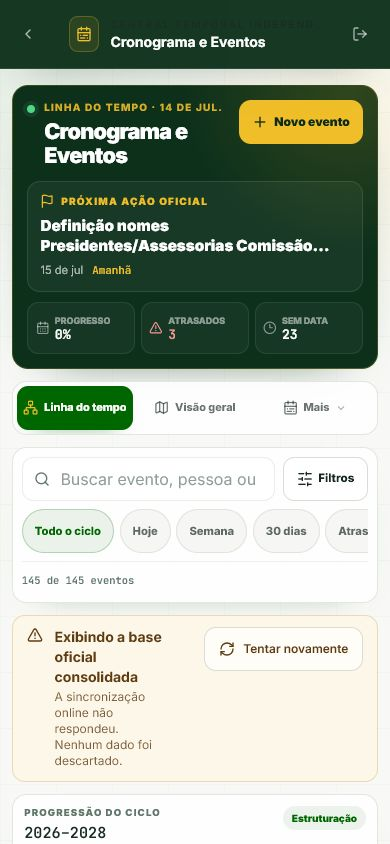
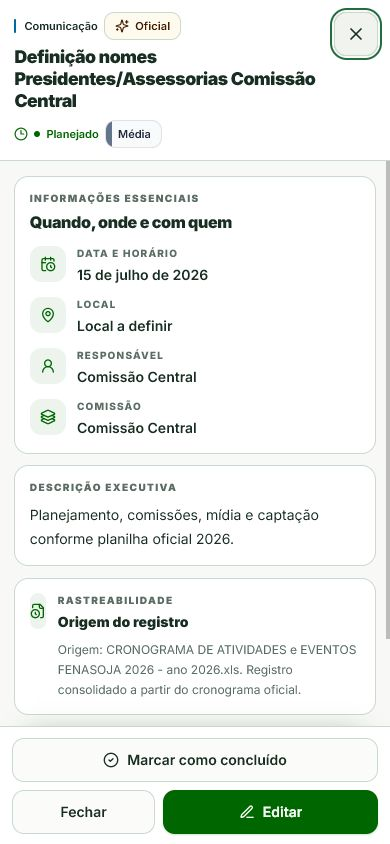
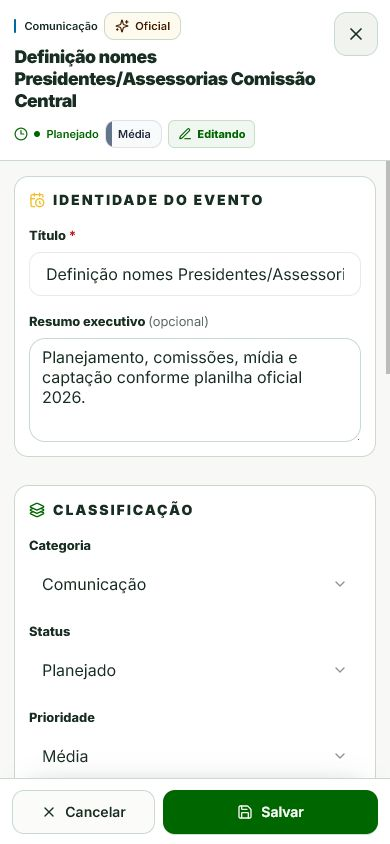
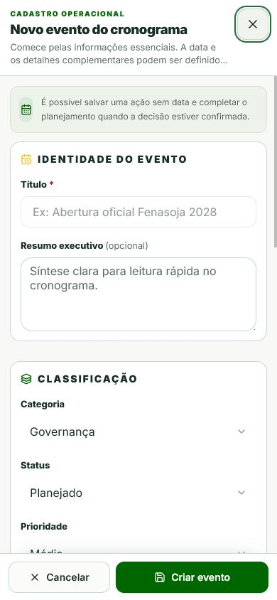
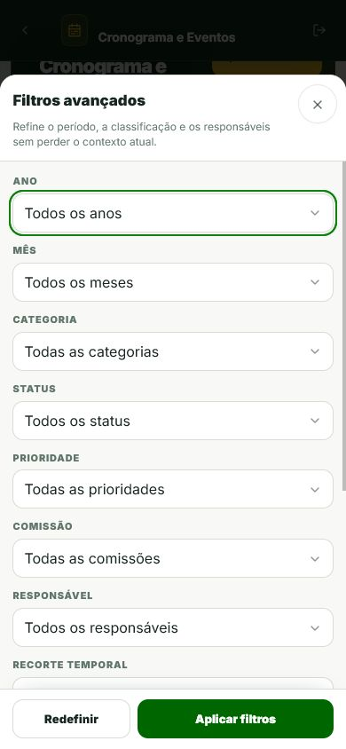
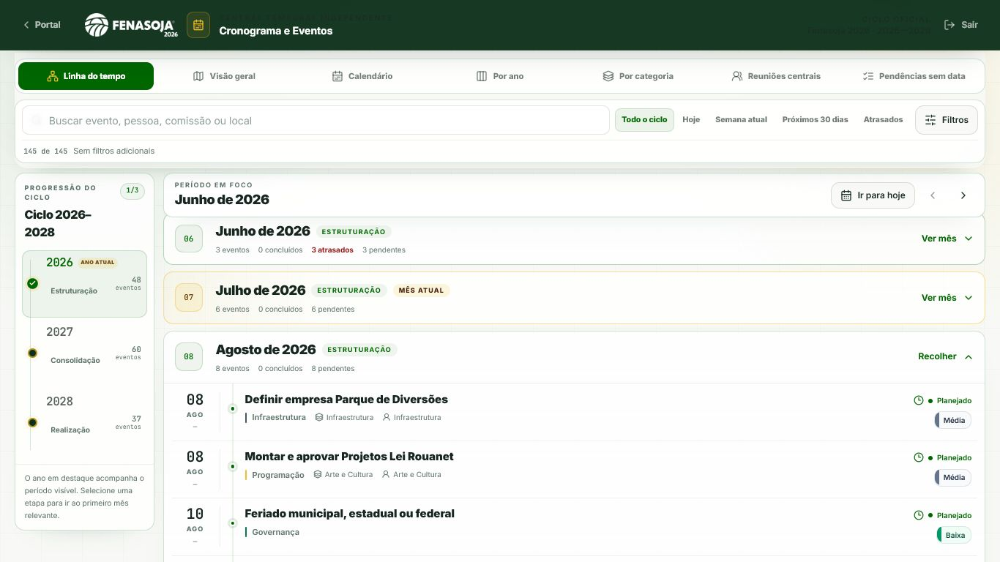
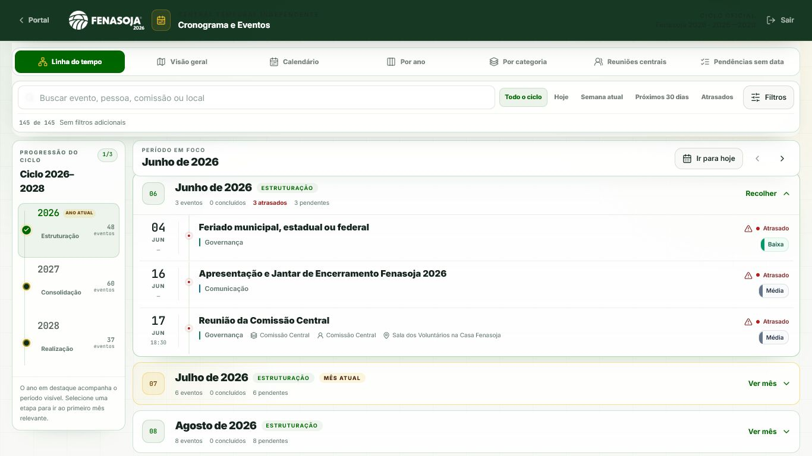

# Cronograma de Eventos — validação mobile para produção

Data da validação: 14/07/2026
Rota: `/cronograma-eventos`

## Resultado

A rota ganhou uma apresentação mobile dedicada, sem substituir a árvore visual existente no desktop. A troca ocorre em larguras de até `899px` e também em telas touch de baixa altura, cobrindo celulares em paisagem. Dados oficiais, sincronização com Supabase, permissões e regras de negócio continuam no fluxo já existente.

## Diagnóstico da experiência anterior

- A mesma composição densa era usada em desktop e celular. Cabeçalho de comando, abas e timeline larga disputavam a pequena largura disponível.
- Drawer e diálogo desktop dependiam de dimensões laterais e do scroll lock do `body`; em mudanças de orientação, isso permitia conteúdo cortado e overlays visualmente residuais.
- Fechamento por voltar, `Escape`, botão e gesto de mudança de viewport não compartilhavam uma política única para formulários sujos ou salvamentos pendentes.
- Campos compactos e rodapés sem vínculo com `visualViewport` ficavam vulneráveis ao zoom automático e à sobreposição pelo teclado virtual.
- A timeline desktop mantinha muitos meses no DOM. Para celular, isso aumentava o trabalho visual e tornava o período atual menos evidente.

## Arquitetura entregue

- Árvore desktop preservada a partir de `900px`.
- Árvore mobile dedicada com cabeçalho compacto, navegação, filtros, progressão 2026–2028, mês em foco e lista operacional.
- Apenas os eventos do mês selecionado são montados na lista mobile; derivações de agrupamento e resumo usam memoização.
- Detalhe, edição e criação usam telas cheias próprias, com `100dvh`, safe areas e ajuste por `visualViewport`.
- Histórico do navegador fecha overlays limpos. Alterações não salvas exigem confirmação e salvamentos pendentes bloqueiam fechamento.
- Uma trava de apresentação preserva o formulário em andamento durante rotação. Ao fechar o overlay, a apresentação é reconciliada com o viewport atual.
- A folha de segurança dos overlays antigos cobre a transição desktop → largura estreita sem perder um formulário já aberto.
- Limites de erro locais impedem que falhas em filtros, timeline ou detalhes derrubem a página inteira.

## Matriz visual validada

As medições abaixo foram feitas no Chromium emulado, na rota autenticada e com o estado real da aplicação.

| Viewport | Apresentação | Overflow horizontal | Alvos visíveis abaixo de 44px |
| --- | --- | ---: | ---: |
| 1024×768 | Desktop | 0 | 0 |
| 768×1024 | Mobile | 0 | 0 |
| 430×932 | Mobile | 0 | 0 |
| 412×915 | Mobile | 0 | 0 |
| 390×844 | Mobile | 0 | 0 |
| 375×812 | Mobile | 0 | 0 |
| 360×800 | Mobile | 0 | 0 |
| 320×568 | Mobile | 0 | 0 |
| 844×390 | Mobile, paisagem touch | 0 | 0 |
| 1366×768 | Desktop | 0 | 0 |
| 1920×1080 | Desktop | 0 | 0 |

Também foram verificados:

- zoom de página em 125%, sem overflow horizontal;
- `prefers-reduced-motion`, com animações reduzidas e rolagem automática;
- `visualViewport` de 390×500 simulando teclado aberto, com foco e rodapé dentro da área visível;
- rotação com cadastro sujo, mantendo o texto digitado e reconciliando a apresentação após o descarte;
- busca por evento em outro mês, reposicionando ano e mês para a primeira correspondência;
- ciclos repetidos de abrir/fechar detalhe, edição, criação e filtros sem portal ou scroll lock residual;
- toques duplicados em fechar e substituição de URL durante criação sem atravessar uma entrada extra do histórico;
- retorno do navegador em overlay limpo e sujo;
- ausência de erros no console; permaneceram apenas avisos já existentes do React Router sobre flags futuras.

## Fluxos funcionais exercitados

- navegar entre 2026, 2027 e 2028 e entre meses adjacentes;
- ir para o mês atual;
- buscar, combinar filtros, limpar filtros e abrir a lista de filtros;
- abrir detalhes e alternar para edição;
- confirmar descarte ou continuar editando;
- validar título obrigatório e horário final posterior ao inicial;
- manter os dados do formulário após falha de salvamento;
- preservar o rascunho durante refetch e na troca de identidade seed → UUID do Supabase;
- bloquear fechar e voltar durante salvamento pendente;
- criar evento, limpar a entrada do histórico e encaminhar para o detalhe criado;
- marcar/reabrir subeventos;
- consultar histórico quando autorizado;
- usar fallback oficial quando a sincronização online não responde, sem inventar dados.

## Acessibilidade

- Controles principais e alvos de toque com mínimo de 44×44px.
- Campos mobile com fonte de 16px para evitar zoom automático no iOS.
- Diálogos com nome e descrição acessíveis, fechamento rotulado, foco contido e retorno de foco.
- Estado do mês anunciado por região `aria-live`.
- Anos e filtros expõem seleção por `aria-pressed` e nomes completos.
- Estados de erro, carregamento e confirmação usam papéis semânticos.
- Safe areas aplicadas no topo e no rodapé.

Não foi executada uma sessão física com VoiceOver/TalkBack ou Safari/iOS; a validação de acessibilidade desta entrega é semântica, automatizada e em Chromium emulado.

## Automação e build

- `npm.cmd run build`: aprovado.
- `npm.cmd run test -- --run`: 12 arquivos e 113 testes aprovados.
- `npx.cmd tsc --noEmit`: aprovado.
- ESLint focado em todos os arquivos TypeScript/TSX alterados ou criados: aprovado.
- `git diff --check`: aprovado.
- O lint global do repositório continua com 988 ocorrências preexistentes em módulos fora do escopo; nenhum erro foi encontrado no lint focado desta entrega.

O build atual gera o chunk lazy da rota `CronogramaEventosPage` com aproximadamente 202,16 kB minificados e 51,75 kB gzip. O mobile monta somente o mês ativo, evitando manter todo o ciclo visual no DOM.

## Evidências

### Mobile — antes e depois

### Detalhe, edição, criação e filtros

### Desktop — referência preservada

Os screenshots desktop foram capturados em estados de mês expandido diferentes; a verificação de preservação considerou a árvore desktop, as sete abas, o breakpoint e a ausência de overflow, não uma comparação pixel a pixel do conteúdo expandido.
